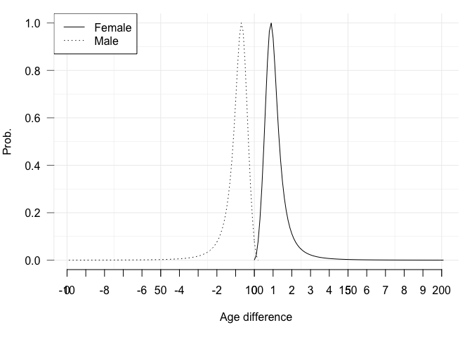

EPP-ASM
================
2019-02-02

This vignette documents the implementation of age- and risk-group-mixing
(mixing for short) model (Tim’s) into current EPP-ASM code. The code
lives at `mixing` branch. The differences compare to the old version
are:

  - We need a new list named `mx` (perhaps put into `fp` later)
    containing all mixing parameters.
  - Adjustments are made to allow more risk groups (e.g., sex indexing,
    distributing of population into groups)
  - The calculation of the force of infection (FOI), consequently the
    number of new infection in each time step.

The following assumptions and parameters are used for prototyping the
model.

## Force of infection

The force of infection (FOI) is defined as in [Hallett, T. B., Gregson,
S., et al. (2007)](http://doi.org/10.1136/sti.2006.023606). Briefly, the
FOI () of a population of sex
, age
, and risk group  is calculated at each time steps as   
,")  
where 
denote the sex, age, and risk group of the opposite sex, respectively.

is the total number of contacts,
 is the mixing pattern with other age and group,

is the tranmission probability, and
 is
the probability of correct and consistent condom usage given the pair.
All the model’s terms are time-dependent but

might not, depending on the availability of data.

### Risk groups mixing


is calculated as   
  
where  is the geometric
mean of the total number of contacts,
 is common
ratio between risk groups and
 is the proportion of population in the group
.

The proportion in low and high risk group are assumed similar for both
male and female. This is used to distribute:

  - the initial population
  - the entrants, healthy and H+
  - immigrants

> TODO: allow different for male and female

``` r
mx <- list()
mx$gamma <- c(.9, .1) # order Low -> High Risk, sum to 1
```

If `mx$gamma` input is of length one, then it is set to 1 and one risk
group model is run.

Higher risk group have tripple the frequency of contacts of the
immediate lower risk group.

``` r
mx$tau <- 3 # common ratio between risk groups
```

where the number of contacts is given with an age- and sex-specific
geometric mean number of contacts.

``` r
mx$M <- matrix(c(c(1.6, 1.6, 1.6, 1.7, 1.6, 1),
                 c(1.2, 1.2, 1.1, 1.5, 1.1, 1),
                 c(15, 20, 25, 30, 40, 50),
                 c(19, 24, 29, 39, 49, 80)), 6, 4, dimnames=list(c("1529", "2024", "2529", "3039", "4049", "50+"), c("M", "F", "lo", "up")))
# expanding the age group provided in M
mx$M. <- function(x) apply(x[, 1:2], 2, rep, times = apply(x[, 3:4], 1, diff) + 1)
mx$Mx <- mx$M.(mx$M)
```

|      |   M |   F | lo | up |
| ---- | --: | --: | -: | -: |
| 1529 | 1.6 | 1.2 | 15 | 19 |
| 2024 | 1.6 | 1.2 | 20 | 24 |
| 2529 | 1.6 | 1.1 | 25 | 29 |
| 3039 | 1.7 | 1.5 | 30 | 39 |
| 4049 | 1.6 | 1.1 | 40 | 49 |
| 50+  | 1.0 | 1.0 | 50 | 80 |

Table: Risk group mixing

 is calculated as   
![C\_{SAGsag} = \\left\[ (1-\\epsilon)\\delta\_{Gg} +
\\epsilon\\left(\\dfrac{C\_{sag}N\_{sag}}{\\sum\_g N\_{sag}
C\_{sag}}\\right)\\right\]\\Delta\_{SAsa},](https://latex.codecogs.com/png.latex?C_%7BSAGsag%7D%20%3D%20%5Cleft%5B%20%281-%5Cepsilon%29%5Cdelta_%7BGg%7D%20%2B%20%5Cepsilon%5Cleft%28%5Cdfrac%7BC_%7Bsag%7DN_%7Bsag%7D%7D%7B%5Csum_g%20N_%7Bsag%7D%20C_%7Bsag%7D%7D%5Cright%29%5Cright%5D%5CDelta_%7BSAsa%7D%2C
"C_{SAGsag} = \\left[ (1-\\epsilon)\\delta_{Gg} + \\epsilon\\left(\\dfrac{C_{sag}N_{sag}}{\\sum_g N_{sag} C_{sag}}\\right)\\right]\\Delta_{SAsa},")  
where ![\\epsilon \\in
\[0,1\]](https://latex.codecogs.com/png.latex?%5Cepsilon%20%5Cin%20%5B0%2C1%5D
"\\epsilon \\in [0,1]") defines whether contacts are assortative or
random with
 is the Koronecker delta.

is the size of the corresponding population.
 is the age-mixing pattern of the pair, defining the
probability that a partnership is formed between an aged
 subject and aged
 subject.

``` r
mx$epsilon <- .2
```

If there is only one group,
 will be set to zero by checking the length of

provided.

The following rates are the same among risk groups, including `Sx,
cd4_mort, cd4_initdist, cd4_prog, paedsurv_cd4dist, art_mort,
paedsurv_artcd4dist`.

 is adjusted to ensure the balance of the number of
partnership calculated from each group, i.e.,

  
  

In particular, we calculate   
  
and adjust

  
  

  
  

In total, we calculate  matrices for this weighting process.

The risk group membership is fixed, i.e. no moving from one risk group
to another.

### Age mixing

 can be defined similarly to the group mixing term with
another
 defining the age-mixing pattern. Here
 is defined by fitting a log-logistic model
() to the sexual partner
age difference data. For female aged
 and male aged


  
,& \\qquad a \\geq A\\\\
  0,& \\text{otherwise},
\\end{cases}
")  
and for male . This is adjusted such that
 where 
denote the age at first sex and age at last sex, respectively.

Age- and sex-specific mixing matrix
() follows a three parameters log-logistic distribution
() in which the scale parameter `r` is shifted by the
age difference between male and female.

``` r
mx$kappa <- 2 # log-logistic shape
mx$rho <- 0.25 # log-logistic scale
r <- 0.15 # log-logistic support
```

This distribution seems too strict. Considering options that allows
female with younger male and higher probability for the same age.



It might be easier to work with the normal age-mixing formula with only
one parameter, but need data to fit.

### Condom usage

The probability of correct and consistent use of among age-groups and
sexes are given as inputs. Below is a condom use data for only ±25 years
old. This is age-dependent not risk group dependent which should be
modified depend on data availability. It is assumed that condom efficacy
in preventing HIV transmission is 90%.

``` r
# prob of correct and consistent condom use by <25 and 25+
mx$chi <- matrix(c(.32, .1, .39, .07), 2, 2,
                 dimnames=list(c("M<25", "M25+"), c("F<25", "F25+")))
mx$cEf <- .9
```

|       | F\<25 | F25+ |
| ----- | ----: | ---: |
| M\<25 |  0.32 | 0.39 |
| M25+  |  0.10 | 0.07 |

Table: Condom usage

### Sexual debut

Population under the age of first sex and above the age of last sex
would not have any sexual contacts in this model. For now the code
covers only the case that both sexes have the same sexual debut period.

``` r
mx$A1 = 16 # age at first sex
mx$A2 = 55 # age at last sex
```

Setting this effectively set FOI of population outside the boundary zero
by making  for those not having sexual acts.

> TODO: different for risk groups

### Tranmission rate

Transmission rate is assumed different for each CD4+ stages () and on ART or not ().

  
![
P\_{sag} = r\_t \\cdot
\\dfrac{\\sum\_{d} w\_{d} \[H\_{sag}^{d,k=0} - H\_{sag}^{d,k=1} (1 -
\\phi)\]}{N\_{sag}} 
\= r\_t \\cdot \\dfrac{H^{\*}\_{sag}}{N\_{sag}}
](https://latex.codecogs.com/png.latex?%0AP_%7Bsag%7D%20%3D%20r_t%20%5Ccdot%0A%5Cdfrac%7B%5Csum_%7Bd%7D%20w_%7Bd%7D%20%5BH_%7Bsag%7D%5E%7Bd%2Ck%3D0%7D%20-%20H_%7Bsag%7D%5E%7Bd%2Ck%3D1%7D%20%281%20-%20%5Cphi%29%5D%7D%7BN_%7Bsag%7D%7D%20%0A%3D%20r_t%20%5Ccdot%20%5Cdfrac%7BH%5E%7B%2A%7D_%7Bsag%7D%7D%7BN_%7Bsag%7D%7D%0A
"
P_{sag} = r_t \\cdot
\\dfrac{\\sum_{d} w_{d} [H_{sag}^{d,k=0} - H_{sag}^{d,k=1} (1 - \\phi)]}{N_{sag}} 
= r_t \\cdot \\dfrac{H^{*}_{sag}}{N_{sag}}
")  

where  denotes the HIV
positive population,  denotes the relative infectiousness of individuals in the disease
stage ,
 is the
relative reduction in infectiousness of the individual taking
cART.

``` r
mx$wD <- cbind(c( 500, 350, 250, 200, 100,  50,  0), # lower bound CD4+ count
               c(1000, 500, 350, 250, 200, 100, 50), # upper
               c(   1,  .1,  .2,  .2,  .7,  .7, .7)) # relative infectiousness
mx$phi <- .3 # ~fp$relinfectART
```

But as the HIV population is grouped,
 is calculated by age-group and distributed as   
  

where  the age-group contains age
.

## Model simulation

Prepare the fix parameters as the vignette example

### Without mixing

Simulate the old model, to check if the tidy up process and the added
code do break anything.

``` r
devtools::load_all()
#> Loading eppasm
modOC <- simmod(fp_par, "C") # old C
#> 
#> Attaching package: 'magrittr'
#> The following objects are masked from 'package:testthat':
#> 
#>     equals, is_less_than, not
modOR <- simmod(fp_par, "R") # old R
prev(modOC)
#>  [1] 0.0000000000 0.0000000000 0.0000000000 0.0000000000 0.0000000000
#>  [6] 0.0000000000 0.0002115617 0.0003353572 0.0005295253 0.0008332484
#> [11] 0.0013069493 0.0020358322 0.0031619043 0.0048919274 0.0075278060
#> [16] 0.0114952631 0.0173160779 0.0256766875 0.0372965514 0.0527891555
#> [21] 0.0724249143 0.0959981021 0.1223878907 0.1498574784 0.1763411128
#> [26] 0.1999167706 0.2192912261 0.2337275925 0.2432604836 0.2483679227
#> [31] 0.2497462402 0.2481788050 0.2442821044 0.2390433031 0.2336087314
#> [36] 0.2289475455 0.2248869398 0.2212650129 0.2179111213 0.2148851567
#> [41] 0.2120610141 0.2092697998 0.2057857477 0.2021365230 0.1981385444
#> [46] 0.1934484450 0.1879411839 0.1818498064 0.1757016454 0.1701286410
#> [51] 0.1646202991 0.1589677009
prev(modOR)
#>  [1] 0.0000000000 0.0000000000 0.0000000000 0.0000000000 0.0000000000
#>  [6] 0.0000000000 0.0002115617 0.0003353572 0.0005295253 0.0008332483
#> [11] 0.0013069491 0.0020358315 0.0031619027 0.0048919239 0.0075277994
#> [16] 0.0114952515 0.0173160589 0.0256766580 0.0372965076 0.0527890932
#> [21] 0.0724248298 0.0959979926 0.1223877553 0.1498573185 0.1763409318
#> [26] 0.1999165733 0.2192910176 0.2337273776 0.2432602664 0.2483677063
#> [31] 0.2497460271 0.2481785968 0.2442819025 0.2390431089 0.2336085461
#> [36] 0.2289473692 0.2248867720 0.2212648522 0.2179109669 0.2148850069
#> [41] 0.2120608674 0.2092696564 0.2057856066 0.2021363852 0.1981384097
#> [46] 0.1934483116 0.1879410523 0.1818496774 0.1757015190 0.1701285554
#> [51] 0.1646202279 0.1589676418
```

The later years are slightly differrence after the third digit. This
results from correcting the negative target population inputs and remove
one line on `grad` update (?). These are important for the mixing model
as the sign of population trouble FOI calculation.

### Mixing model

Model with one and two risk groups per sex.

``` r
devtools::load_all() # 2b remove
#> Loading eppasm
mx$gamma <- c(.9,.1)
modN2 <- simmod(fp_par, "R", isMixing = TRUE, mx)
mx$gamma <- 1
modN1 <- simmod(fp_par, "R", isMixing = TRUE, mx)
# profvis::profvis(simmod(fp_par, "R", isMixing = TRUE, mx))
# Vectorize outer make thing worse
```

FOI

``` r
plot(modN2)
```


``` r
plot(modN1)
```


Prevalence


> TODO: add relavtive transmission rate for pair of risk group. This
> should go to transmission rate section.

``` r
# Template data (Thembisa)
mx$betaPair <- array(1, c(2,2,2))
# Susceptible male
mx$betaPair[,,1] <- matrix(c(1, 1.25, 1.08, 1.23), 2, 2,
                      dimnames=list(c("M-Low", "M-High"), c("F-Low", "F-High")))
# Susceptible female
mx$betaPair[,,2] <- matrix(c(1, 1.14, 1.09, 1.20), 2, 2,
                      dimnames=list(c("M-Low", "M-High"), c("F-Low", "F-High")))
```

|      |      |
| ---: | ---: |
| 1.00 | 1.08 |
| 1.25 | 1.23 |

Table: Relative transmission rate for susceptible male

|      |      |
| ---: | ---: |
| 1.00 | 1.09 |
| 1.14 | 1.20 |

Table: Relative transmission rate for susceptible female

> TODO: which data, fitting which parameteres? TODO: Projection?