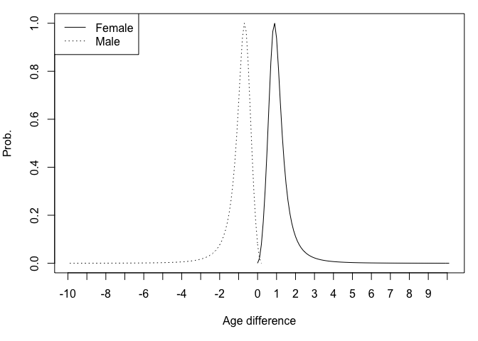

EPP-ASM
================
2019-01-31

This vignette documents the implementation of age- and risk-group-mixing
(mixing for short) model (Tim’s) into current EPP-ASM code. The code
lives at `mixing` branch. The differences compare to the old version
are:

<!-- and generating outputs to provide as Spectrum inputs. -->

  - We need a new list named `mx` (perhaps put into `fp` later)
    containing all mixing parameters; `mx` enters `simmod` as the
    function’s argument.
  - Call `simmod(fp, isMixing=TRUE, mx)` to specify whether to run
    mixing model, otherwise the old model does.
  - Adjustments are made to allow more risk groups (e.g., sex indexing,
    distributing of population into groups)
  - The calculation of the force of infection (FOI), consequently the
    number of new infection in each time step.

## The model

The force of infection (FOI) is defined as in [Hallett, T. B., Gregson,
S., et al. (2007)](http://doi.org/10.1136/sti.2006.023606). Briefly, the
FOI () of a population of sex
, age
, and risk group  is calculated at each time steps as   
,")  
where 
denote the sex, age, and risk group of the opposite sex, respectively.

is the total number of contacts,
 is the mixing pattern with other age and group,

is the tranmission risk, and
 is
the probability of correct and consistent condom usage given the pair.
All the model’s terms are time-dependent but

might not, depending on the availability of data.


is calculated as   
  
where  is the geometric
mean of the total number of contacts,
 is common
ratio between risk groups and
 is the proportion of population in the group
.

 is calculated as   
![C\_{SAGsag} = \\left\[ (1-\\epsilon)\\delta\_{Gg} +
\\epsilon\\left(\\dfrac{C\_{sag}N\_{sag}}{\\sum\_g N\_{sag}
C\_{sag}}\\right)\\right\]\\Delta\_{SAsa},](https://latex.codecogs.com/png.latex?C_%7BSAGsag%7D%20%3D%20%5Cleft%5B%20%281-%5Cepsilon%29%5Cdelta_%7BGg%7D%20%2B%20%5Cepsilon%5Cleft%28%5Cdfrac%7BC_%7Bsag%7DN_%7Bsag%7D%7D%7B%5Csum_g%20N_%7Bsag%7D%20C_%7Bsag%7D%7D%5Cright%29%5Cright%5D%5CDelta_%7BSAsa%7D%2C
"C_{SAGsag} = \\left[ (1-\\epsilon)\\delta_{Gg} + \\epsilon\\left(\\dfrac{C_{sag}N_{sag}}{\\sum_g N_{sag} C_{sag}}\\right)\\right]\\Delta_{SAsa},")  
where ![\\epsilon \\in
\[0,1\]](https://latex.codecogs.com/png.latex?%5Cepsilon%20%5Cin%20%5B0%2C1%5D
"\\epsilon \\in [0,1]") defines whether contacts are assortative or
random with
 is the Koronecker delta.

is the size of the corresponding population.
 is the age-mixing pattern of the pair, defining the
probability that a partnership is formed between an aged
 subject and aged
 subject.

 can be defined similarly to the group mixing term with
another
 defining the age-mixing pattern. Here
 is defined by fitting a log-logistic model
() to the sexual partner
age difference data. For female aged
 and male aged


  
,& \\qquad a \\geq A\\\\
  0,& \\text{otherwise},
\\end{cases}
")  
and for male . This is adjusted such that
 where 
denote the age at first sex and age at last sex, respectively.

Lastly,
 needs to be adjusted to ensure the balance of the number
of partnership calculated from female and male, i.e.,

  
  

In particular, we calculate   
  
and adjust 

## Assumptions and parameters

The following assumptions and parameters are used for prototyping the
model.

### Age mixing

Age- and sex-specific mixing matrix
() follows a three parameters log-logistic distribution
() in which the scale parameter `r` is shifted by the
age difference between male and female.

``` r
mx <- list(kappa = 3.04, # log-logistic shape
           rho = 2.85, # log-logistic scale
           r = 0.11) # log-logistic support
```

This distribution seems too strict. Considering options that allows
female with younger male and higher probability for the same age.



It might be easier to work with the normal age-mixing formula with only
one parameter, but need data to fit.

### Risk groups mixing

The proportion in low and high risk group are assumed 80% and 20%. This
is used to distribute:

  - the initial population
  - the entrants, healthy and H+
  - immigrants

<!-- end list -->

``` r
mx$gamma <- c(.8, .2) # Default order: Low High, sum to 1
```

If `mx$gamma` is of length one, then it is set to 1 and one risk group
model is run.

The following transition rates are the same among groups:

  - Natural survival rate
  - cd4\_mort, cd4\_initdist, cd4\_prog, paedsurv\_cd4dist,
  - art\_mort, paedsurv\_artcd4dist

Higher risk group have tripple the frequency of contacts of the
immediate lower risk group.

``` r
mx$tau <- 3 # common ratio between risk groups
```

where the number of contacts is given with an age- and sex-specific
geometric mean number of contacts.

``` r
mx$M <- matrix(c(c(1.6, 1.6, 1.6, 1.7, 1.6, 1),
                 c(1.2, 1.2, 1.1, 1.5, 1.1, 1),
                 c(15, 20, 25, 30, 40, 50),
                 c(19, 24, 29, 39, 49, 80)), 6, 4, dimnames=list(c("1529", "2024", "2529", "3039", "4049", "50+"), c("M", "F", "lo", "up")))
# expanding the age group provided in M
mx$M. <- function(x) apply(x[, 1:2], 2, rep, times = apply(x[, 3:4], 1, diff) + 1)
mx$Mx <- mx$M.(mx$M)
```

|      |   M |   F | lo | up |
| ---- | --: | --: | -: | -: |
| 1529 | 1.6 | 1.2 | 15 | 19 |
| 2024 | 1.6 | 1.2 | 20 | 24 |
| 2529 | 1.6 | 1.1 | 25 | 29 |
| 3039 | 1.7 | 1.5 | 30 | 39 |
| 4049 | 1.6 | 1.1 | 40 | 49 |
| 50+  | 1.0 | 1.0 | 50 | 80 |

Table: Risk group mixing

### Condom usage

The probability of correct and consistent use of among age-groups and
sexes are given as inputs. Below is a condom use data for only ±25 years
old. This is age-dependent not risk group dependent which probably
should be modified.

``` r
# prob of correct and consistent condom use by <25 and 25+
mx$chi <- matrix(c(.32, .1, .39, .07), 2, 2,
                 dimnames=list(c("M<25", "M25+"), c("F<25", "F25+")))
```

|       | F\<25 | F25+ |
| ----- | ----: | ---: |
| M\<25 |  0.32 | 0.39 |
| M25+  |  0.10 | 0.07 |

Table: Condom usage

### Sexual debut

Population under the age of first sex and above the age of last sex
would not have any sexual contacts in this model. For now the code
covers only the case that both sexes have the same sexual debut period.

``` r
mx$A1 = 16 # age at first sex
mx$A2 = 55 # age at last sex
```
