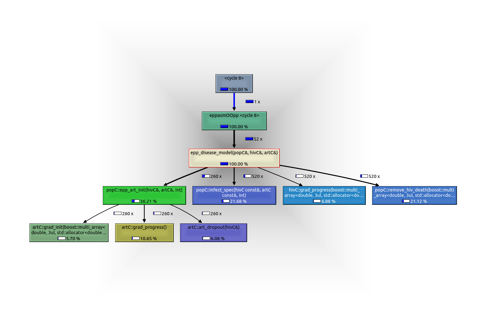

# Profiling C++ code in R with Valgrind, LLDB

> On Linux (tested on Ubuntu 14.04)

## Requirements

```bash
sudo apt-get install valgrind
sudo apt-get install kcachegrind
```

##Install R 3.6

```bash
sudo apt install apt-transport-https software-properties-common
sudo add-apt-repository 'deb https://cloud.r-project.org/bin/linux/ubuntu trusty-cran35/'
sudo apt-key adv --keyserver keyserver.ubuntu.com --recv-keys E298A3A825C0D65DFD57CBB651716619E084DAB9
sudo apt-get update
sudo apt-get install r-base r-base-dev r-base-core
sudo apt-get install libxml2-dev libcurl4-openssl-dev
```

## Install `eppasm`

Clone and load eppasm

`mrc-ide/eppasm@debut_withClass`, this branch built OK.

```bash
sudo apt-get install git
git clone --depth=50 --branch=debut-withClass https://github.com/mrc-ide/eppasm.git mrc-ide/eppasm
cd mrc-ide/eppasm/
git checkout -qf 8b52c091196f8db1f7140e0c49019d8ead66d3b1
```

Install packages as needed

```bash
Rscript -e 'install.packages(c("remotes"));if (!all(c("remotes") %in% installed.packages())) { q(status = 1, save = "no")}'
Rscript -e 'remotes::install_github(c("jeffeaton/anclik/anclik"))'
Rscript -e 'deps <- remotes::dev_package_deps(dependencies = NA);remotes::install_deps(dependencies = TRUE);if (!all(deps$package %in% installed.packages())) { message("missing: ", paste(setdiff(deps$package, installed.packages()), collapse=", ")); q(status = 1, save = "no")}'
```

Build and check 

```bash
R CMD build .
R CMD check *.tar.gz --as-cran
```

## Profiling

Run `R` with debug options

```bash
R -d "valgrind --tool=callgrind"
```

within R

```R
# rebuild
system('rm ./src/*.o')
system('rm ./src/*.so')
devtools::load_all()

pjnz <- system.file("extdata/testpjnz", "Botswana2018.PJNZ", package="eppasm")
bw <- prepare_spec_fit(pjnz, proj.end=2022.5)
bw_fp <- attr(bw$Urban, "specfp")
bw_fp <- prepare_rhybrid(bw_fp)
bw_fp$ancsitedata <- TRUE
bw_fp$ancrt <- "census"
bw_fp$ancrtsite.beta <- 0
bw_fp$logitiota <- TRUE
bw_theta <- c(-0.407503322169364, -2.76794181367538, -1.26018073624346, 1995.96447776502,
       -0.00307437171215574, 0.0114118307148102, 0.00760958379603691, 0.02,
       2.24103194827232, -0.0792123921862689, -5.01917961803606, 0.359444135205712,
       -6.10051517060137)
param <- fnCreateParam(bw_theta, bw_fp)
bw_fp <- update(bw_fp, list=param)
test <- simmod(bw_fp, "K")
quit("no")
```

## Output

Load profile

```bash
kcachegrind callgrind.out.####
```

each run will have a process ID.



## Other stuffs

Check with LLDB

```bash
sudo apt-get install lldb-3.9
R -d lldb-3.9
```

Leak check

```bash
R -d "valgrind --leak-check=full"
```

### Start from CoreDump

Unpack the dump

```bash
apport-unpack /var/crash/name_of_crash.crash ~/Downloads/folder
```

Load to lldb
```bash
lldb-3.9 /usr/lib/R/bin/exec/R ~/Download/folder/CoreDump
```
